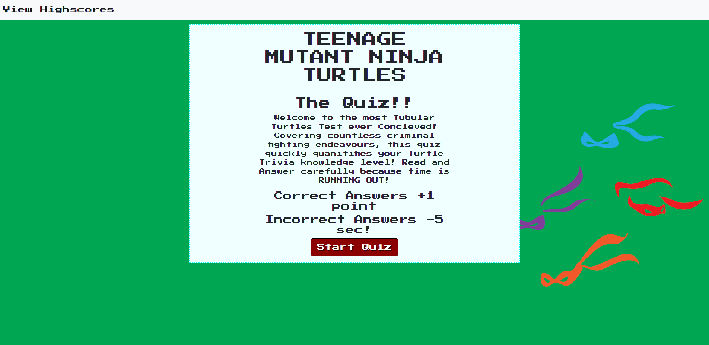
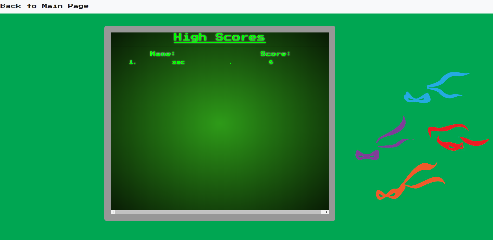

# CODE QUIZ - NINJA TURTLES EDITION

## UW Code Bootcamp Week 3 Assignment - Due 3/17/2020
## Happy St. Patrick's Day!

## Project Description

My Turtles Code Quiz is functioning quiz game.  When the start button is pressed the user is presented with a series of knowledge questions about the Teenage Mutant Ninja Turtles! For each correct answer, one point is added to the user's total.  For each Incorrect answer, **5 seconds are removed from the clock!** 

After the timer runs out, you can enter a name to post your score to the High Scores Page!

 [Click Here](https://the-medium-place.github.io/code-quiz/) to view the deployed project.

 

 

## Overall Thoughts

This project was the bane of my existence for the last several days and countless hours.  This week officially slammed me face-first into the wall of my previous knowledge, but I've worked very hard and I'm proud of what I created. Thanks for taking a look!

## Initial Concept

My original plans with this project was to build a large HTML framework and write the javascript logic around it.  So, I built a series of `div`s that held the questions and answer buttons and wrote a `js` program that successfully cycled from one to the next by toggling the `style` attribute between `style: none;` and `style: block;`.  

Unfortunately I found it too difficult to have effective and efficient event listeners with so many fields to track.  

After a tutoring session I was able to refactor my code into its current form, with a single question window containing rotating fields of information. 

## The Code

* I set an array called `questionsArr` to house all of the question info.
* This array houses a series of objects. Each object contains 3 key/value pairs:
    * `questionText`: string value of the question
    * `answerOptions`: an array containing four answer options
    * `correctAnswer`: correct answer - matching one from the previous array

* **init();**
    * This function checks for local storage data, and populates the `userValues` variable if so

* **buttonListen();**
    * I wrote all of the button listeners for the answer buttons into a single function. 
    * Each button compares the clicked value to the stored `correctAnswer` and updates the score for correct answers.
    * For Incorrect answers, the `wrongAnswer` variable changes from 0 to 1, which triggers an drop in time in a later function.
    * `displayQuestion();` is called to change the question content.

* **timer();**
    * When activated, this function creates the 30 second timer and displays the counter on the page. 
    * Timer running out triggers the final `div` to show which contains the name entry field

* **displayQuestion();**
    * This function utilizes a counter called `questionCounter`
    * With each question, the values of the `questionsArr` array are updated using the `questionCounter` as the index value.
    * After the data is populated, the `questionCounter` is increased for the next iteration of the function

* **startQuiz();**
    * This function clears the start page and displays the question page
    * Then, it calls `timer();`, `displayQuestion();` and `buttonListen();` to start the game proper!

* **Button Listeners** 
    * I set listeners at the bottom for the Start button and the button to submit user info.

## Thank You!